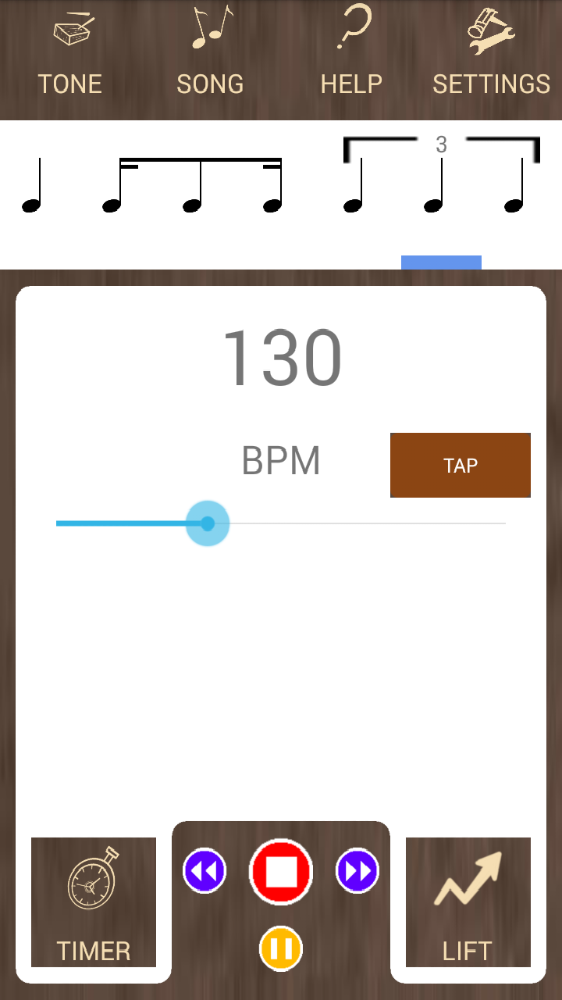

# MetronomeAmplified
A cross-platform metronome app - a time-keeping training aid for musicians.
Made for Android Kitkat and above, Windows 10, and Windows 10 Phone.

## About
The intention of this application is to support my own education. I do not intend to make money out of this project, and will only release it for free download from respective app stores. It is intended to be competitive alongside similar existing apps in the market, by offering a similar or superior feature set in the form of a free product.
This application is coded using Xamarin.Forms, with XAML and C# driving the user interface and code-behind respectively.
At present, only an Android version and a Universal Windows Platform version are being developed. I do not have the resources to develop an iOS version at this point in time.

## Installation Instructions
You will require Visual Studio installed on a Windows computer, including the component for cross-platform mobile development with Xamarin, with the Android SDK or Windows SDK to build those components.
* Clone this repository
* Open the Visual Studio Solution file in the root directory
* Select the desired Solution Platform, Startup Project, and deployment target (device or emulator) from the drop-down lists in the toolbar
* Start with or without debugging from the Debug menu to build and deploy the application
